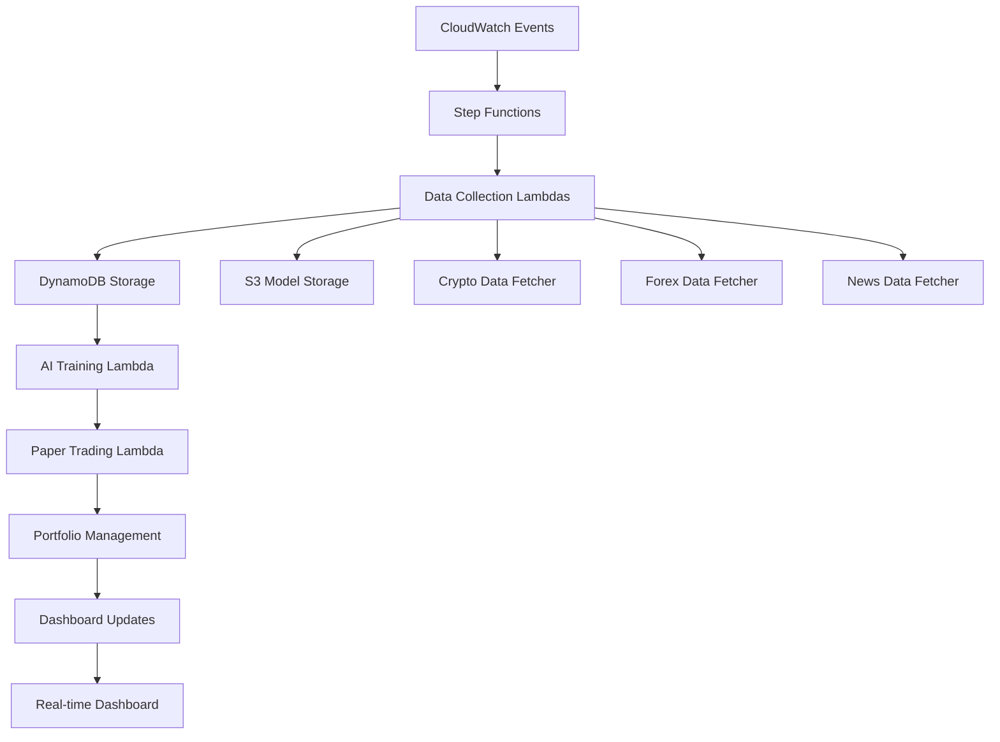

# 🚀 AWS Crypto & Forex AI Trading System

A comprehensive, serverless AI-powered trading system built on AWS that automatically collects market data, trains machine learning models, and executes paper trades with a $50 starting balance.

[](https://aws.amazon.com/)
[](https://www.oracle.com/java/)
[](https://www.python.org/)
[](LICENSE)

## 📊 Features

- **🔄 Real-time Data Collection**: Automatic collection of crypto and forex market data every 15 minutes
- **🤖 AI-Powered Trading**: Machine learning models retrained every 6 hours for optimal performance  
- **📈 Paper Trading**: Safe trading environment with $50 initial balance and risk management
- **🎯 Professional Dashboard**: Real-time monitoring with interactive charts and analytics
- **⚡ Serverless Architecture**: Cost-effective, auto-scaling AWS infrastructure
- **🛡️ Risk Management**: Built-in stop-loss, take-profit, and position sizing controls

## 🏗️ Architecture



## 🚀 Quick Start

### 1. Prerequisites
- AWS CLI configured with your credentials
- Java 21 and Maven
- Python 3.12+
- SAM CLI

### 2. Deploy to AWS
```bash
# Build Java Lambdas first
cd aws-java-lambdas && mvn clean package && cd ..

# Deploy with SAM
sam build -t aws-infrastructure/template.yaml
sam deploy --guided
```

### 3. Access Dashboard
After deployment, access your trading dashboard at the URL provided in the output.

## � CI/CD Pipeline

This project uses **GitHub Actions** to automatically build and deploy to AWS on every push to `main`.

### Setup Required GitHub Secrets

Go to your repo → **Settings** → **Secrets and variables** → **Actions** → **New repository secret** and add:

| Secret Name | Description | Required |
|---|---|---|
| `AWS_ACCESS_KEY_ID` | IAM user access key with deployment permissions | ✅ |
| `AWS_SECRET_ACCESS_KEY` | IAM user secret access key | ✅ |
| `AWS_REGION` | AWS region (e.g. `us-east-1`) | ✅ |
| `S3_BUCKET_MODELS` | S3 bucket for AI models (default: `forex-ai-models`) | Optional |

### Required IAM Permissions

The IAM user needs these permissions for SAM deployment:
- `cloudformation:*` — Stack management
- `lambda:*` — Lambda function deployment
- `iam:*` — Role creation for Lambdas
- `s3:*` — Artifact upload & model storage
- `dynamodb:*` — Table creation
- `states:*` — Step Functions
- `events:*` — CloudWatch Events/Schedules
- `logs:*` — CloudWatch Logs

> **Tip**: Use the AWS managed policy `AdministratorAccess` for development, or create a scoped policy for production.

### Pipeline Stages

1. **Build Java Lambdas** — Maven compiles & tests the data-fetcher JARs (JDK 21)
2. **SAM Build** — Packages all Lambda functions & layers
3. **SAM Deploy** — Deploys the CloudFormation stack to AWS
4. **Validation** — Verifies the stack is in a healthy state

### Manual Deployment

You can also trigger a deployment manually from the **Actions** tab and select the target environment (`dev`, `staging`, `prod`).

## �📁 Project Structure

```
Paper-Trading/
├── 📂 aws-java-lambdas/           # Real-time data collection
│   ├── src/main/java/
│   │   ├── CryptoDataFetcher.java  # Crypto price fetching
│   │   ├── ForexDataFetcher.java   # Forex data collection
│   │   └── NewsDataFetcher.java    # Market sentiment analysis
│   └── pom.xml                     # Maven dependencies
├── 📂 python-ai-trading/          # AI trading system
│   ├── ai_trainer.py              # ML model training
│   ├── paper_trader.py            # Trading execution
│   └── dashboard_updater.py       # Real-time updates
├── 📂 aws-infrastructure/         # AWS resources
│   ├── template.yaml              # SAM template
│   └── step-function-definition.json
├── 📂 dashboard/                  # Web interface
│   ├── index.html                 # Trading dashboard
│   ├── styles.css                 # Professional styling
│   └── dashboard.js               # Real-time data handling
├── start-dashboard.bat            # Launch local dashboard
├── cleanup-stack.bat              # Resource cleanup
├── bucket-policy.json             # S3 bucket policy
└── requirements.txt               # Root Python dependencies
```

## 🎯 Trading Strategy

### Supported Assets
- **Crypto**: Bitcoin, Ethereum, Binance Coin, Cardano, Solana, Polkadot, Chainlink, Litecoin, Avalanche, Polygon
- **Forex**: EUR/USD, GBP/USD, USD/JPY, USD/CHF, AUD/USD, USD/CAD, NZD/USD

### Risk Management
- **Initial Balance**: $50.00 USD
- **Risk per Trade**: 2% of portfolio value
- **Stop Loss**: 5% automatic
- **Take Profit**: 10% target
- **Max Open Positions**: 5 concurrent
- **Daily Trade Limit**: 10 trades

### AI Model Training
- **Algorithm**: Ensemble of Random Forest and Gradient Boosting
- **Features**: Price action, volume, technical indicators, sentiment
- **Retraining**: Every 6 hours with latest market data
- **Validation**: Walk-forward analysis with out-of-sample testing

## 📊 Dashboard Features

### Portfolio Overview
- Current balance and P&L
- Open positions summary
- Daily/monthly performance
- Risk metrics

### Live Market Data
- Real-time crypto prices
- Forex rate updates
- Market sentiment indicators
- Trading volume analysis

### Performance Analytics
- Equity curve visualization
- Win/loss ratio statistics
- Sharpe ratio tracking
- Maximum drawdown monitoring

### AI Model Metrics
- Training accuracy scores
- Prediction confidence levels
- Model version history
- Feature importance rankings

## 🔧 Configuration

### Environment Variables
Copy `config/aws-config.template.env` to `.env` and configure:

```bash
# AWS Configuration
AWS_REGION=us-east-1
S3_BUCKET=forex-ai-models

# API Keys (optional)
COINGECKO_API_KEY=your_key_here
ALPHA_VANTAGE_API_KEY=your_key_here
NEWS_API_KEY=your_key_here

# Trading Parameters
INITIAL_BALANCE=50.0
RISK_PERCENTAGE=2.0
TRAINING_INTERVAL_HOURS=6
```

### Customization
Modify trading parameters in:
- `python-ai-trading/ai_trainer.py` - ML algorithms
- `python-ai-trading/paper_trader.py` - Trading logic
- `aws-infrastructure/template.yaml` - AWS resources

## 💰 Cost Estimation

**Monthly AWS costs**: ~$10-22

| Service | Estimated Cost |
|---------|---------------|
| Lambda Functions | $5-10 |
| DynamoDB | $2-5 |
| S3 Storage | $1-3 |
| CloudWatch | $1-2 |
| Data Transfer | $1-2 |

## 📈 Performance Metrics

### Expected Results (Paper Trading)
- **Target Monthly Return**: 2-5%
- **Maximum Drawdown**: <10%
- **Win Rate**: 55-65%
- **Sharpe Ratio**: >1.0
- **Trade Frequency**: 2-5 per day

### System Performance  
- **Data Latency**: <30 seconds
- **Model Training**: 5-10 minutes
- **Trade Execution**: <1 minute
- **Dashboard Updates**: Real-time (30s refresh)

## 🔍 Monitoring

### CloudWatch Dashboards
Monitor system health and trading performance:
- Lambda function metrics
- DynamoDB read/write capacity
- Trading system alerts
- Cost optimization metrics

### Logs and Debugging
```bash
# View Lambda logs
aws logs tail /aws/lambda/CryptoDataFetcher --follow

# Check trading performance
aws dynamodb scan --table-name TradingHistory

# Monitor AI model accuracy
aws s3 ls s3://forex-ai-models/models/
```

## 🛠️ Development

### Local Testing
```bash
# Install Python dependencies
pip install -r requirements.txt

# Build and test Java components
cd aws-java-lambdas && mvn clean package

# Start local dashboard
start-dashboard.bat
```

### Contributing
1. Fork the repository
2. Create a feature branch
3. Make your changes
4. Add tests for new functionality
5. Submit a pull request

## 🔒 Security

- All API keys stored in AWS Systems Manager
- IAM roles with least privilege access
- Data encryption in transit and at rest
- Regular security updates and patches

## 🆘 Support

### Common Issues
1. **AWS CLI not configured**: Run `aws configure`
2. **SAM CLI missing**: Install from [AWS docs](https://docs.aws.amazon.com/serverless-application-model/latest/developerguide/serverless-sam-cli-install.html)
3. **Java build failures**: Ensure Java 21+ and JAVA_HOME set
4. **API rate limits**: Configure API keys in environment

### Getting Help
- Check CloudWatch logs for errors
- Review GitHub issues
- AWS documentation
- Community forums

## 📄 License

This project is licensed under the MIT License - see the [LICENSE](LICENSE) file for details.

## ⚠️ Disclaimer

**This is a paper trading system for educational purposes only.** 

- No real money is used or at risk
- Past performance does not guarantee future results
- The system is for learning algorithmic trading concepts
- Always do your own research before real trading
- Consider consulting a financial advisor

## 🎉 Acknowledgments

- AWS Serverless Application Model (SAM)
- CoinGecko API for crypto data
- Alpha Vantage for forex data
- NewsAPI for market sentiment
- Chart.js for visualizations
- Bootstrap for UI components

## 🔮 Roadmap

### Version 2.0 (Planned)
- [ ] Advanced ML models (LSTM, Transformer)
- [ ] Multi-timeframe analysis
- [ ] Social sentiment integration
- [ ] Mobile app companion
- [ ] Real trading capabilities (with safeguards)
- [ ] Portfolio optimization algorithms
- [ ] Advanced risk management tools

---

**Happy Trading! 📈💰**

Built with ❤️ for the AWS and trading communities.